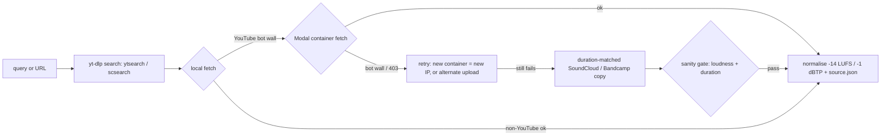

# Music tools: sourcing, analysis, generation

Songs are first-class material (the principal, 2026-09-26: personal, non-commercial
use; see AGENTS.md rails). Public streams, his files and open libraries only.
There is no DRM circumvention. Method lives in skills `music-source`
(`musiclib.py`), `song-map` (`modal_audio.py` for GPU stems/beats), `fal-media`
(ledger rates) and `sound-design`. This note holds the observed facts behind
them. The principal is not an audio professional, so music reports to him use plain words.

## Why / Context
The first music-capability lab (`projects/lab-music/`, [[lab-music]], 2026-09-26) surveyed
every route before building. The generator landscape and YouTube access both
change fast. Re-verify after the half-life, and re-pull prices from the fal
pricing API (below) before trusting the table.

## Sourcing: what actually reaches this box

- **YouTube streams are bot-walled from the box IP.** Every call fails with "Sign
  in to confirm you're not a bot", on every player client tried (`tv`,
  `android_vr`, `web_safari`, `mweb`, `ios`, `web_embedded`, `tv_simply`).
  **Search still works** (`ytsearch5:` with `--flat-playlist` returns in about 2 s).
  Only the stream fetch is blocked.
- **The Modal route works intermittently.** A yt-dlp fetch inside a Modal
  container got Get Lucky's best stream (Opus ~134 kbps). The same route
  bot-walled on Blinding Lights, and one Levels upload returned HTTP 403 while
  another upload of the same song succeeded. Each container gets a different
  IP, so retry and try alternate uploads (official audio or "Topic" uploads).
  Blinding Lights went through on the second container. 4 of 4 songs were
  fetched this way in the lab.
  Cookies would be the reliable fix, but they need the principal's YouTube session
  (not held).
- yt-dlp 2026.08.19 needs `--js-runtimes node` (plus `yt-dlp-ejs`). It is
  installed in `tools/py`. Call it as `$PY -m yt_dlp`, because no `yt-dlp`
  binary is on PATH after `source tools/env.sh`.
- **SoundCloud traps:**
  - `scsearch` works from the box, but many label uploads are 30.0 s previews.
  - Some tracks are refused with "This video is DRM protected". That refusal is
    the DRM limit enforcing itself.
  - Bootleg re-uploads rank high. Blinding Lights' "OFFICIAL FREE VERSION" by
    BASSBANGERS was a 114 s edit (real song ≈ 200 s) at **−1.14 LUFS / +7.37
    dBTP**, which means bass-boosted and clipped.
  - Gate fallbacks: reject input louder than about −5 LUFS, and reject any whose
    duration deviates more than about 12 % from the expected length
    (`musiclib.py fetch --expect <album seconds>` also re-ranks by length).
  - Name the file after the candidate that actually downloaded, not the first
    one tried. A first run named a vocal Levels download "levels-instrumental".
- **Bandcamp** free streams are mp3-128 only (C418 "Sweden" test).
- Official uploads come in hot: Get Lucky −10.5 LUFS / +2.4 dBTP, Levels
  −9.1 LUFS / +2.3 dBTP. Normalise with two-pass loudnorm to −14 LUFS / −1 dBTP
  and keep the untouched original next to the normalised copy.

### Free metadata, lyrics and open libraries (no key unless noted)
| Source | Gives | Gotcha |
|---|---|---|
| LRCLIB `lrclib.net/api/get?artist_name=&track_name=` | synced `[mm:ss.xx]` line lyrics + plain | line times are a check on whisper alignment, not word-level |
| MusicBrainz `ws/2/recording?query=…&fmt=json` | MBIDs, lengths, release dates | **403 with a generic UA**; needs a descriptive `User-Agent` ("Muse/1.0 (…)") |
| Deezer `api.deezer.com/track/<id>` | `bpm` (Get Lucky 116.1), `gain`, ISRC | a tempo hint, not ground truth; search results carry 30 s previews. The advanced `artist:"…" track:"…"` search returns nothing for some tracks (Avicii Levels), so fall back to a plain `artist title` query |
| iTunes Search API | metadata + 30 s previews | previews only |
| Openverse `api.openverse.org/v1/audio/?q=` | Jamendo + Freesound with licence fields | many Jamendo tracks are NC/ND; check licence per track |
| Internet Archive `advancedsearch.php` | CC audio with `licenseurl` | filter `licenseurl:*creativecommons*` |
| ccMixter `ccmixter.org/api/query?f=json&tags=a_cappella` | CC-BY stems and a cappellas | good for remix material |
| Freesound / Pixabay / Jamendo APIs | loops, SFX, tracks | need keys (not held) |

Checked 2026-09-26:
- **Free Music Archive**: the old API is gone (`/api/get` returns 404);
  only its HTML search is up. Not wired.
- **YouTube Audio Library**: requires a Google sign-in.
- **Pixabay**: the API needs a key; the site is behind Cloudflare (403).
- **Freesound**: the API needs a key, but its CC0/CC-BY previews arrive
  through Openverse without one. `musiclib.py open` fetched a CC0 Freesound
  timpani that way, licence line included.

## Understanding and editing on this box
- The static ffmpeg 7.0.2 in `tools/` has `rubberband`, `loudnorm`, `ebur128`,
  `sidechaincompress`/`sidechaingate`, `acrossfade`, `atempo` and
  `showspectrumpic`. Grid edits, tempo/pitch changes, ducking and mastering all
  run locally for $0.
- **`sidechaincompress` is not a usable ducker.** It cut the output to the
  voice's length and dipped about 15 dB for a nominal 8 dB. `trackedit.py duck`
  uses a numpy envelope follower instead: measured −8.0 dB under the voice
  and 0.0 dB elsewhere.
- The indexed library is `library/music/<slug>/` + `index.json` (8 tracks on
  2026-09-26). Audio is gitignored; the index and song maps sync. Take the BPM
  from a beat_this grid before indexing. A local-tracker analysis indexed
  the 171 BPM synthwave take at the half-time 85.5.
- There is no torch or librosa locally (Python 3.13 venv, and disk law
  forbids a ~1 GB torch install). **Essentia 2.1b6 (38 MB) is installed**:
  it gives the key (EDMA profile). Its tempo reads half-time on fast songs.
  Heavy models run elsewhere:
  - Demucs stems and beat_this beats/downbeats run on Modal via
    `song-map/scripts/modal_audio.py` (functions `stems_gpu`, `stems_cpu`,
    `beats_gpu`, `fetch_remote`).
  - Stems can also come from fal (table below).
- Ground truth used for accuracy tests: Get Lucky 116 BPM F♯ minor, Blinding
  Lights 171 BPM F minor, Levels 126 BPM C♯ minor.

## Generators and separators (seen 2026-09-26)
Prices are from `GET https://api.fal.ai/v1/models/pricing?endpoint_id=…` (auth
`Key $FAL_KEY`). The catalog is at `https://fal.ai/api/models?keywords=music`.
Schemas are at `https://fal.ai/api/openapi/queue/openapi.json?endpoint_id=…`. All
of these rates are in `fal.py`, so ledger costs are automatic.

| Endpoint (fal) | Price | Vocals | Control surface | Edit / extend |
|---|---|---|---|---|
| `elevenlabs/music/v2.5` (also v2, `fal-ai/elevenlabs/music`) | $0.60 per **started** minute (30 s bills as 1 min) | yes | prompt mode: `music_length_ms` 3–600 s, `force_instrumental`. **`composition_plan`**: ≤30 chunks of 3–120 s (total ≤600 s), each with `[Section]` + lyric lines + `{inline directions}`, positive/negative styles, `context_adherence`, per-chunk `audio_reference` (first chunk dominates). `seed` only with a plan | chunk durations = exact section boundaries = cue points |
| `google/lyria-3.5` | $0.10 / generation | yes, timed lyrics returned | prompt only. Structure via timestamps `[0:00-0:30] Intro: …`; `image_url`; no negative prompt; 8 languages | none (single-turn) |
| `fal-ai/lyria3` / `lyria3/pro` | $0.04 / $0.08 | yes | prompt + image | none |
| `minimax/music-3` | $0.002 / s | yes (lyrics **required**) | up to 300 s; Structured Caption with Genre/BPM/Key/arrangement. Structure tags must sit alone on their line (text after a tag on the same line is dropped). `duration` is an upper bound and the model may stop early. Output 44.1 kHz WAV | none |
| `fal-ai/minimax-music/v2.6` | $0.15 / audio | yes (or `is_instrumental`) | lyrics ≤3500 chars with tags, `lyrics_optimizer` | none |
| `fal-ai/stable-audio-3/medium/*` | $0.0376 t2a · $0.0442 inpaint · $0.0446 outpaint · $0.0417 a2a | no | ≤380 s, negative prompt, seed; licensed training data | **inpaint** by `mask_start/end_seconds`, **outpaint** `extend_seconds_before/after`, a2a `init_noise_level` |
| `fal-ai/stable-audio-3/small/music/text-to-audio` | $0.0217 | no | same family, smaller | same family |
| `fal-ai/stable-audio-25/text-to-audio` | $0.20 | no | `seconds_total` | inpaint endpoint |
| `sonilo/v1.1/text-to-music` | $0.0025 / s / sample (<10 s bills as 10 s) | no | exact `duration` ≤600 s, 1–3 samples, m4a out | video-to-music $0.009/s |
| `fal-ai/ace-step` (v1) | $0.0002 / s | yes | tags + `[verse]/[chorus]` lyrics | audio-to-audio (`edit_mode` lyrics or remix), inpaint, outpaint |
| `fal-ai/diffrhythm` | $0.01 / 10 s | yes | only 95 s or 285 s; lyrics need ≥2 sections; reference audio | none |
| `cassetteai/music-generator` | $0.02 / min | no | prompt | none |
| `bytedance/seed-audio-1.0` | $0.1875 / min | speech-first | ≤3 audio refs (`@Audio1..3`, ≤30 s each) or an image | none |
| `fal-ai/demucs` | $0.0007 / input s (~$0.13 per 3-min song) | n/a | default `htdemucs_6s`: vocals, drums, bass, other, guitar, piano | none |
| `fal-ai/sam-audio/separate` | $0.05 / 30 s (+$0.025 per extra rerank) | n/a | isolate any sound by text prompt, `predict_spans` | none |
| `fal-ai/elevenlabs/audio-isolation` · `sound-effects/v2` · `fal-ai/audio-understanding` | $0.10/min · $0.002/s · $0.01/5 s | n/a | n/a | n/a |

Outside fal:
- **Suno and Udio have no public API.** docs.suno.com is unreachable, the
  studio API returns 404 and udio.com/api returns 404. **Mureka** has an API
  platform, and **Stability** has a direct API, but no key is held for either.
- **ElevenLabs direct Music API** is for paid subscribers only; the free plan
  returns 402, so use fal (see [[generation-field-notes]]). The direct API also
  has inpainting, Music Finetunes and a stem-separation endpoint
  (`/v1/music/stem-separation`). **Audio Reference (≤ ~30 s) is screened for
  copyright.** This was confirmed through fal: a 30 s instrumental slice
  of Blinding Lights (vocals removed) was refused with HTTP 422 and not
  billed. A code-made beat of our own was accepted as a reference. For
  "in the style of <song>", describe the song in words from its song map
  (tempo, key, instrumentation), or use Stable Audio 3 audio-to-audio or
  ACE-Step 1.5's reference audio. ElevenLabs describes Eleven Music as
  cleared for commercial use.
- **Google Lyria via the Gemini API** offers `lyria-3-clip-preview` (always 30 s),
  `lyria-3.5` (full songs) and Lyria RealTime streaming, all needing
  `GEMINI_API_KEY` (not held). Google's documented limits:
  - prompts naming artist voices or asking for copyrighted lyrics are blocked;
  - every output carries a SynthID watermark;
  - generation is single-turn, with no iterative edit.
- **YuE2** (m-a-p, released ~14 Sep 2026; code Apache-2.0):
  - Weights are free for personal creators, including monetised outputs;
    companies need a commercial licence.
  - Needs 24 GB VRAM and Python 3.12; `pip install .`, then
    `YuE2Pipeline.from_pretrained("m-a-p/YuE2-3B")`.
  - It plans an editable ABC score (melody + chords, key, tempo) before
    rendering 48 kHz audio. It also does covers from a score and
    instrumentals via its agent skill.
  - It claims Suno v5/v6 parity on WildSongBench.
  - Runs via `music-gen/scripts/modal_yue2.py`.
- Other open models checked 2026-09-26:
  - MusicGen (audiocraft): weights CC-BY-NC, repo quiet since Mar 2026.
  - Stable Audio Open 1.0: HF-gated, no HF_TOKEN held; its successor
    Stable Audio 3 is on fal.
  - DiffRhythm: on fal (95/285 s only).
  - SongGeneration / SongBloom repos: not found at the checked paths.
- **ACE-Step 1.5** (open, MIT, `ace-step` 1.5.0, requires Python ≥3.11,<3.13):
  - HF repo `ACE-Step/Ace-Step1.5` bundles Qwen3-Embedding-0.6B, the 5 Hz LM
    1.7B, the v15-turbo DiT and the VAE.
  - Runs in <4 GB VRAM and generates 10 s–10 min, under 2 s per song on an A100.
  - Metadata control: BPM, key/scale, time signature.
  - Edit tasks: repaint (`task_type="repaint"`, start/end seconds), cover,
    stem separation, Vocal2BGM, LRC timestamps. LoRA training needs about 8 songs.
  - The XL 4B variants (Apr 2026) need ≥12 GB VRAM with offload, 20 GB
    recommended.
  - **fal hosts only v1**, so 1.5 must run on Modal.

## Measured in the lab (2026-09-26)
Evidence: `projects/lab-music/review/results.md` (every table),
`review/spectro/sheet-b*.jpg`, generated takes in `gen/<brief>/`. Spend for
the whole lab $5.45 of a $25 cap.

**Analysis accuracy (3 real songs; beat_this used as the beat reference, kick
transients on the Demucs drum stem as the referee):**
- Stems. Modal L4 took 37 s for a 4:09 song (≈ $0.013). fal-ai/demucs took
  52 s ($0.17). A 2-vCPU CPU took 625 s. All three ran htdemucs_ft.
- beat_this: 3–4 s of GPU per song, 87–91 % of kicks on a beat, +15 ms
  after the kick. It is the only method that got Blinding Lights at 171.
  The local tracker and Essentia both said 85.5.
- The local tracker (after the 46 ms frame-stamp fix) scored beat F = 0.998
  against beat_this on Get Lucky and Levels. Downbeats reach 0.99 / 0.87
  only with the drum stem plus the chord-change cue; mix-only picked the
  wrong bar phase.
- Key: Essentia EDMA gave F minor for Blinding Lights (correct), B minor for
  Get Lucky (labels say F♯ minor) and E major for Levels (labels say C♯ minor).
  The last two are the relative or fourth-related key, and the label
  sources themselves disagree.
- Lyrics:
  - Whisper on a whole vocal stem drifted 2–17 s, so it now transcribes in
    ≤28 s chunks.
  - LRCLIB's Get Lucky lines are timed to the album edit, **16.5 s late** on
    the 4:08 radio edit. The offset is detected automatically before
    anchoring.
  - Anchored line starts land within 1 s of LRCLIB for 95 % of heard lines on
    Get Lucky (40 lines; 45 % within 0.3 s) and 100 % on Blinding Lights (29
    lines; 72 % within 0.3 s; the LRC was 0.6 s off for the lyric-video edit). That is a rough check, because
    LRCLIB is human-timed. Word-level truth is still the vocal stem waveform.

**Generators, same four briefs** (octave-aware tempo; "hit" = strongest
transient within ±1 s of the requested time):

| | 30 s beat @128 | cue with hits @8/16/24 s | 48 s song, my lyrics (vocal-stem WER) | style of Blinding Lights |
|---|---|---|---|---|
| ElevenLabs v2.5 (plan) | 30.07 s, 127.99 BPM | hits 618 ms off | 48.0 s, 100 BPM, WER 0.00 | text: 171 ✓, F minor ✓, closest brightness; built then faded from 22 s. Audio ref of the song **refused** (copyright screen); own-audio ref OK |
| Lyria 3.5 | 62.6 s (ignores length), tempo ✓ | 62.7 s, no hits | 62.2 s, WER 0.00 | 60.7 s, 171 ✓ |
| Lyria 3 / 3 Pro | 30.8 s, tempo ✓ | transients near hits (40 ms) but no level jump | 46.0 s, WER 0.00 | — |
| MiniMax Music 3 | **17.2 s, 136 BPM** | 162 BPM | 48.1 s but 120 BPM, WER 0.00 | 142 BPM ✗ |
| MiniMax 2.6 | — | — | 55 s, 100 BPM, WER 0.00 | — |
| Stable Audio 3 | 30.0 s, 128.0 BPM | 30.0 s, 90 BPM, bar lines on 8/16/24, swells not hits | (no vocals) | 30.0 s, 171 ✓, kept the drive all 30 s |
| Stable Audio 3 audio-to-audio | — | — | — | closest chroma (0.988), remix-like |
| ACE-Step 1.5 (Modal) | 30.0 s, 128 BPM; 1 of 2 takes silent last 7 s | ended at 21 s | 48.0 s, 100 BPM, WER 0.02 | 171 ✓, silent after 24 s |
| ACE-Step v1 (fal) | smeared transients | — | WER 0.33 | — |
| YuE2 3B (Modal L40S, open; released Sep 2026) | — | — | 60 s (no length control), 100.4 BPM, WER 0.13; wrote its own score in E major (ignored "C major"); 30 s to generate, ≈ $0.04 | — |
| Sonilo | 30.0 s but ignored tempo | — | — | — |
| js-scoring (code) | exact | **hits within 5 ms, +8 dB** | — | — |

- **Key compliance** (Essentia; same, relative or parallel key counted as
  right): ACE-Step 1.5 5/5, ElevenLabs 3/4, Stable Audio 3 2/3, MiniMax 2.6
  1/1, MiniMax 3 1/4, Lyria 3.5 0/4, Lyria 3/3 Pro 0/3, YuE2 0/1. YuE2 plans
  its key in an editable ABC score; pass `abc=` to force the key. The detector is
  itself approximate: it read our code-made A-minor beat as C major and the
  D-minor cue as D major. ACE-Step 1.5 takes key as metadata, which is why
  it complies.
- **No music model placed a hit on an absolute timestamp.** They build on
  their own bar and phrase grid. The combination that works: choose a BPM
  that puts the hits on bar lines. At 90 BPM, 8 s is exactly 3 bars. Then
  generate the bed with an exact-length model (Stable Audio 3 landed a
  downbeat at 7.999 s) and add code-made impacts on top. The lab measured
  **1–2 ms** hit error on its render, with +5 to +25 dB jumps, mastered at
  −13.7 LUFS. **A re-measure of the delivered MP3 disagrees**: onsets at
  7.967 s, 16.009 s and 24.010 s, so −33 ms, +9 ms and +10 ms. That is still
  inside one frame at 30 fps, but it is not 1–2 ms. The likely cause is MP3
  encoding plus onset-detector granularity. Promise "within a frame",
  measure on the final file, and nudge any hit that lands more than a frame
  off.
- **Default singer: ACE-Step 1.5, decided by ear.** On the same 48 s song
  the measurements scored ACE-Step 1.5 and ElevenLabs v2.5 about the same
  (WER 0.02 vs 0.00, both on length and tempo). The principal listened and heard a
  clear winner in ACE-Step 1.5 (open, Modal, ~$0.02): a cleaner voice that
  stays human through high and low notes (2026-09-26).
  - **Default for sung songs:** ACE-Step 1.5. Generate 3 takes and drop any
    that end early (2 of 5 lab runs did).
  - **Fallback:** ElevenLabs v2.5 composition plans, when exact section
    structure matters more than the voice.
  - **Lesson:** objective scores can't pick a voice. Vocal quality needs a
    human listen.
- Whisper on full mixes dropped whole verses (WER 0.3–0.6 on songs whose
  vocal stems score 0.00). Always judge lyrics on the vocal stem.
- ElevenLabs bills per started minute and is fast (8–14 s). Stable Audio 3
  is fast (4–8 s) when the queue is idle but saw 230 s under load. MiniMax
  takes 34–122 s. ACE-Step 1.5 on Modal takes 80–117 s including a 75 s cold
  start.

Related: [[generation-field-notes]] (ElevenLabs Music behaviour on real
projects, beat-grid offset), [[tool-selection]] (engines per shot),
`vex-021` (a generated score in production).
